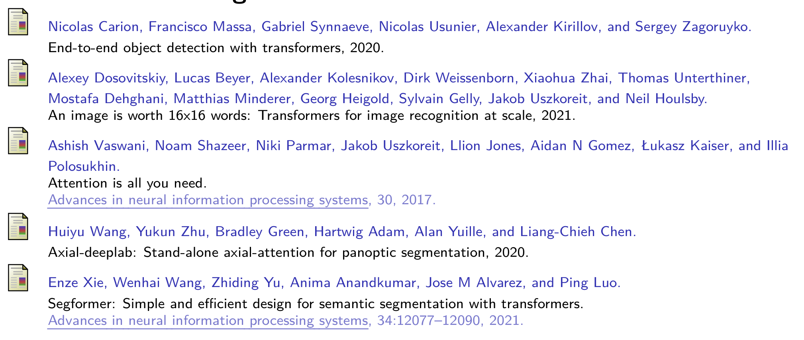
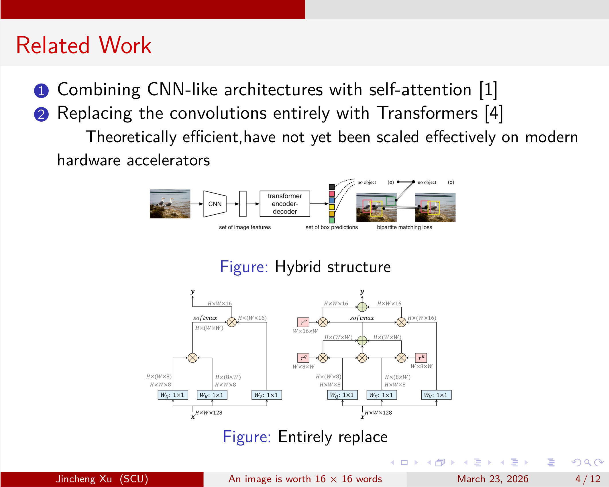

# ViT
基于 Beamer 的学术演示文稿模板，适用于论文汇报、学术报告等场景。\
学术演示文稿，采用 **XeLaTeX** 编译器

## 模板

- 原始模板: [LaTeX-PPT-Template](https://github.com/Urinx/LaTeX-PPT-Template)

## 内容

演示文稿基于论文 **"An Image is Worth 16×16 Words: Transformers for Image Recognition at Scale"** (ViT)，共包含以下幻灯片：

| 序号 | 标题 | 内容概要 |
|:---:|------|----------|
| 1 | 标题页 | ViT 论文介绍、作者信息 |
| 2 | Transformer 结构 | Transformer 架构图及结论 |
| 3 | Motivation | Transformer 相比 CNN 的优势：计算效率、可扩展性 |
| 4 | Related Work | 混合架构与纯 Transformer 的对比 |
| 5 | Superiority of ViT | ViT 在图像分类任务上的优势 |
| 6 | Performance | 模型性能对比表（ImageNet、CIFAR 等数据集） |
| 7 | Structure | ViT 模型整体架构图 |
| 8 | Method (1) | 数据预处理：图像分块、线性投影、位置编码 |
| 9 | Method (2) | 归纳偏置：位置编码方式对比实验 |
| 10 | Limitation (1) | 分辨率变化导致性能下降问题 |
| 11 | Limitation (2) | 图像特定归纳偏置减少 |
| 12 | References | 参考文献 |

### 核心内容

- **ViT 核心思想**: 将图像划分为固定大小的 patch，将每个 patch 视为一个 token，类似于 NLP 中的词元
- **关键创新**: 纯 Transformer 架构在图像分类任务上达到 SOTA 性能
- **主要贡献**:
  - 提出 Vision Transformer 架构
  - 大规模预训练优于归纳偏置
  - 多头注意力机制可学习长距离依赖


## 文件结构

```
Latex/
├── main.tex          # 主 LaTeX 文件
├── main.pdf          # 编译输出的 PDF
├── paper_ref.png     # 论文参考图
├── README.md         # 说明文档
└── fig/              # 图片目录
    ├── trans.png     # Transformer 结构图
    ├── hybrid.png    # 混合模型图
    ├── ResNet.png    # ResNet 对比图
    └── ...           # 其他图片
```
> ⚠️ 注意: 模板开头已指定 `!TeX program = xelatex`，可直接运行编译。

## 参考文献

参考文献文件为 `ref.bib`，使用 BibTeX 格式管理。
PDF最后一页



## 预览
